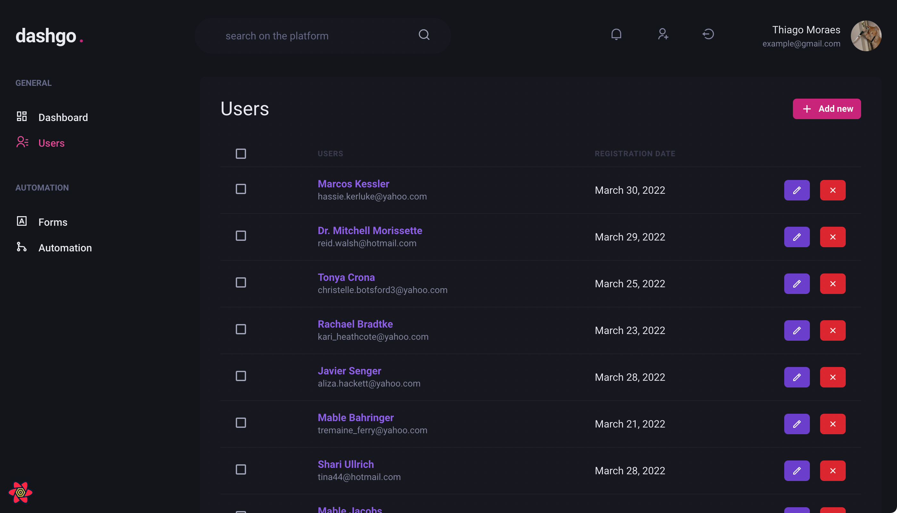

<div align="center" id="top">
  
</div>

<hr/>
<br>

## About

A Dashboard made it for MVPs with support to many providers.

## Screenshots

<div align="center" id="top">
  
</div>
<br/>

## Features

- complete CRUD.
- Auth2.
- Easy to understand and change.

## Technologies

The following tools were used in this project:

- [React](https://pt-br.reactjs.org/)
- [TypeScript](https://typescriptlang.org/)
- [Next](https://nextjs.org)
- [NextauthJS](https://next-auth.js.org)
- [Chakra UI](https://chakra-ui.com)
- [React Query](https://react-query.tanstack.com)

## Requirements

Before starting 🏁, you need to have [Git](https://git-scm.com), [Node](https://nodejs.org/en/) and [Yarn](https://yarnpkg.com) installed, and an account on [google api](https://cloud.google.com/google/api) to use google as the auth provider, if not you can choose any provider you want.

also you have to fill the .env file.

### Starting

```bash
# Clone this project
$ git clone git@github.com:Thiago-spart/dashboard-ignote-react.git

# Access
$ cd dashboard-ignote-react

# Install dependencies
$ yarn

# Run the project in developer mode
$ yarn dev

# The server will initialize in the <http://localhost:3000>
```

## License

This project is under license from MIT. For more details, see the [LICENSE](LICENSE).

Made with ❤️ and ☕

## Contributors ✨

## About

React Router is developed and maintained by [Thiago Spart](https://github.com/Thiago-spart) and [Alessandro H. Ramos](https://github.com/aleessandrohr).

&#xa0;

<a href="#top">Back to top</a>
